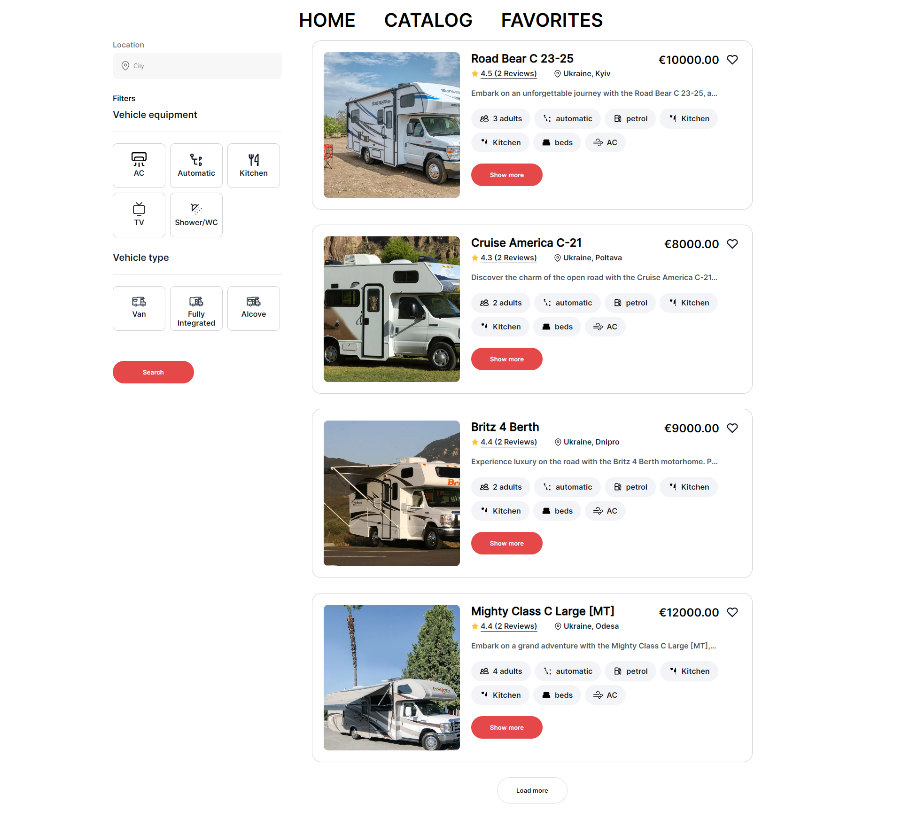

Campers Campers is a website for searching and booking campers.

Campers is a platform designed for discovering and reserving camper
accommodations globally.

Description Campers simplifies the process of finding and reserving campers
worldwide. With an intuitive interface, users can effortlessly explore various
camper options, refine their search with filters, access comprehensive details
about each accommodation, and proceed with secure online bookings.

Functionality Search: Easily search for camper accommodations based on diverse
criteria, such as location, type, and amenities. Details: Access
detailedinformation about each camper, including high-quality photos, authentic
reviews,and ratings. Booking: Seamlessly book accommodations online via a
user-friendly interface, ensuring a hassle-free reservation process. Profile:
Register and create a personalized profile to manage bookings, save preferences,
and enhance the overall experience. Campers

